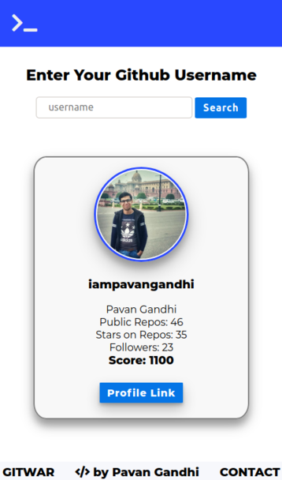

<div align="center">


# **Gitwar - Compete with Git**

   

## Website : https://gitwar.herokuapp.com/

---

</div>

## Screenshots

<div align="center">



</div>

## Local Setup

```sh
# install dependencies
npm install

# serve with hot reload at localhost:3000
npm run dev
```

## Features

- Check your Github Score. Based on -
  - Your Public Repos
  - Stars on Public Repos
  - Forks on Public Repos
  - Github Followers
  - Joined Github Organisations
- Compete with Friends and Other Github Users
- View Trending Repos of 5 Different Languages

## Tech Stack

- Expressjs (Nodejs)
- Axios (HTTP client)
- EJS (Template Engine)
- Github API
- Heroku for deployment

## API Credits

#### Special Thanks to [Huchenme](https://github.com/huchenme) for the [Github Trending Api](https://github.com/huchenme/github-trending-api)

## License

[MIT](LICENSE) © Pavan Gandhi

---

<div align="center">

### Connect me on [Linkedin](https://www.linkedin.com/in/iampavangandhi/) and Follow on [Github](https://github.com/iampavangandhi).

</div>
